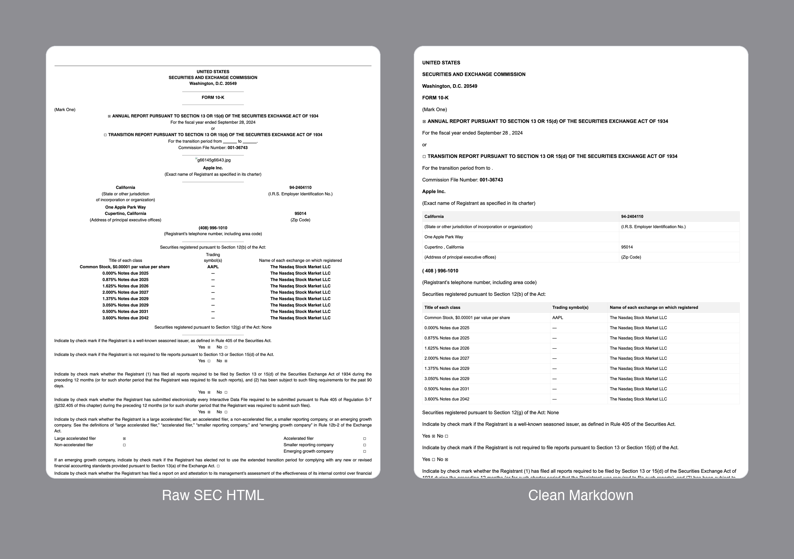
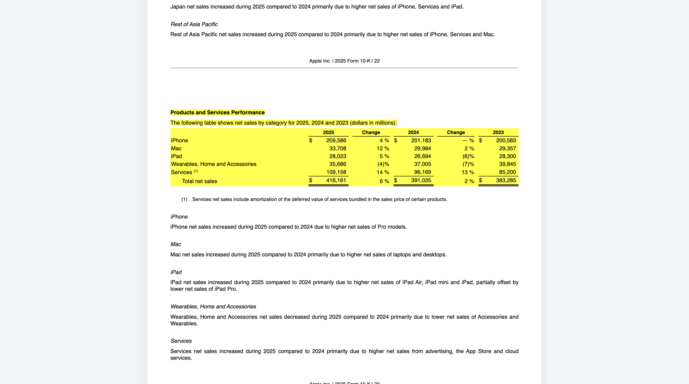

# sec2md

[](https://pypi.org/project/sec2md)
[](LICENSE)
[](https://sec2md.readthedocs.io)

Transform messy SEC filings into clean, structured Markdown.
**Built for AI. Optimized for retrieval. Traceable to the source.**


*Apple 10-K: Raw SEC HTML (left) vs. sec2md output (right)*

---

## The Problem

SEC filings are the worst documents you'll ever feed to an LLM — 200 pages of nested HTML, XBRL tags, invisible elements, and tables-within-tables. Standard parsers break tables into garbled text, collapse sections into a single wall of prose, and lose the formatting cues that LLMs need to reason over structured content.

But even the converters that handle the HTML well still throw away **provenance**. You get clean text with no way to trace an answer back to where it came from in the original filing. For production RAG on regulated documents, that's a dealbreaker.

## The Solution

```python
import sec2md

pages = sec2md.parse_filing(
    "https://www.sec.gov/Archives/edgar/data/320193/000032019323000106/aapl-20230930.htm",
    user_agent="Your Name <you@example.com>"
)

# 60 pages | 293 citable elements | 46,238 tokens
# Tables intact. Pages tracked. Sections detected. Every element traceable.
```

`sec2md` rebuilds SEC filings as clean, semantic Markdown — preserving structure, tables, and pagination. Unlike generic converters, it also preserves the **full citation chain** from every piece of output back to the source HTML, and extracts **iXBRL tags** so you can filter by the accounting taxonomy itself.

---

## Supported Filings

sec2md works with any SEC filing served as HTML. For filings with standardized structure, it also extracts individual sections automatically:

| Filing Type | Section Extraction |
|---|---|
| **10-K** | 18 items (ITEM 1–16), full PART/ITEM detection |
| **10-Q** | 11 items (Parts I & II) |
| **8-K** | 41 items (1.01–9.01), exhibit parsing |
| **20-F** | Items 1–19, 16A–16I |
| **SC 13D** | 7 items (Items 1–7) |
| **SC 13G** | 10 items (Items 1–10) |

All other filing types — S-1, S-3, S-4, F-1, 424B, 6-K, DEF 14A, DEFA14A, 40-F, N-CSR, SC TO-T, and any HTML exhibit or attachment — are parsed as clean Markdown with full traceability.

## Complex Table Handling

SEC tables are notoriously complex — rowspans, colspans, merged cells, currency symbols in separate columns. Some filings don't even use `<table>` tags, building tables from absolutely-positioned CSS divs instead.

sec2md handles both:

```markdown
| Product Category | Revenue (millions) |
|------------------|-------------------|
| iPhone           | $200,583          |
| Mac              | $29,357           |
| iPad             | $28,300           |
```

## Section-Aware Parsing

A 10-K is modular — Business, Risk Factors, MD&A, Financial Statements. sec2md detects PART and ITEM boundaries automatically, so you can pull exactly the section you need instead of processing 200 pages:

```python
from sec2md import Item10K

sections = sec2md.extract_sections(pages, filing_type="10-K")
risk = sec2md.get_section(sections, Item10K.RISK_FACTORS)

print(risk.page_range)  # (7, 19)
print(risk.tokens)       # 11,474
print(risk.markdown()[:200])
```

## Chunking for RAG

Page-aware, token-budgeted chunks — each one carrying page numbers, element IDs, and display pages from the filing footer:

```python
chunks = sec2md.chunk_pages(pages, chunk_size=512)

for chunk in chunks:
    print(chunk.content)             # Clean markdown text
    print(chunk.page_range)          # (12, 13)
    print(chunk.display_page_range)  # (45, 46) — as printed in the filing
    print(chunk.element_ids)         # Traceable source elements
    print(chunk.has_table)           # True — tables kept intact
```

You can also chunk individual sections or XBRL TextBlocks. Large tables are automatically split across chunks with headers preserved.

## Multimodal: Image Extraction

Charts, performance graphs, and segment breakdowns are extracted as first-class elements — same page tracking, same element IDs, same citation chain as every paragraph and table:

```python
chunks = sec2md.chunk_pages(pages)

for chunk in chunks:
    if chunk.has_image:
        print(chunk.images)       # Image elements with full traceability
        print(chunk.page_range)   # Where it appeared in the filing

# Self-contained HTML — no broken image links
pages = sec2md.parse_filing(url, user_agent="...", embed_images=True)
```

Feed chunks with images to a vision model. Feed the rest to text. Every image stays traceable back to the source filing.

## Traceability

Every paragraph, table, and heading gets a **stable element ID** that maps directly to a DOM node in the original filing HTML. From chunk to element to source — the chain is unbroken.

The parser injects these IDs directly into the HTML via `parser.html()` — so every element in your Markdown output has a corresponding tagged node in the source. You can store that annotated HTML yourself, and given any chunk's `element_ids`, locate and highlight the exact source nodes in the original filing.

```python
parser = sec2md.Parser(filing_html)
pages = parser.get_pages()
chunks = sec2md.chunk_pages(pages)

# The annotated HTML has element IDs injected into the DOM
annotated_html = parser.html()

# See exactly where a chunk comes from in the original filing
chunk = chunks[5]
chunk.visualize(annotated_html)

# Or drill down to a single element
chunk.elements[0].visualize(annotated_html)
```


*`element.visualize()` opens the original filing HTML, scrolls to the source element, and highlights it.*

When your LLM says "revenue was $394B" and compliance asks *show me* — you can point to the exact location in the filing. Not the chunk. Not the Markdown. The source.

## iXBRL Tag Extraction

iXBRL filings embed structured financial facts directly in the HTML. sec2md extracts the XBRL concept names and attaches them to elements and chunks — giving you a metadata filter for retrieval. Instead of relying on semantic search alone, you can scope your query to only chunks tagged with the exact XBRL concepts you care about.

```python
pages = sec2md.parse_filing(url, user_agent="...")
chunks = sec2md.chunk_pages(pages)

# Store chunk.tags as metadata in your vector DB, then filter at query time:
# "What was Apple's revenue?" + metadata filter: tags contains 'us-gaap:Revenue*'

# Or filter in code — find the balance sheet
[e for p in pages for e in (p.elements or []) if e.tags and 'us-gaap:Assets' in e.tags]

# All revenue-tagged chunks
[c for c in chunks if any('Revenue' in t for t in c.tags)]
```

On a real Apple 10-K: 76 of 293 elements carry XBRL tags across 330 distinct concepts. The Income Statement table alone carries 15 tags, the Balance Sheet 32, Cash Flows 29. Cover page elements get `dei:*` tags, and notes get their TextBlock concept names.

---

## Installation

```bash
pip install sec2md
```

## Getting Started

Try the [Getting Started notebook](examples/getting_started.ipynb) — parse a real 10-K, extract sections, chunk for RAG, and visualize traceability in under a minute.

### Works with edgartools

```python
from edgar import Company

company = Company("AAPL")
filing = company.get_filings(form="10-K").latest()
pages = sec2md.parse_filing(filing.html())
```

## Documentation

Full documentation: [sec2md.readthedocs.io](https://sec2md.readthedocs.io)

- [Quickstart Guide](https://sec2md.readthedocs.io/quickstart)
- [Convert Filings](https://sec2md.readthedocs.io/usage/direct-conversion)
- [Extract Sections](https://sec2md.readthedocs.io/usage/sections)
- [Chunking for RAG](https://sec2md.readthedocs.io/usage/chunking)
- [EdgarTools Integration](https://sec2md.readthedocs.io/usage/edgartools)
- [API Reference](https://sec2md.readthedocs.io/api/convert_to_markdown)

---

## Contributing

We welcome contributions! See [CONTRIBUTING.md](CONTRIBUTING.md) for guidelines.

## License

MIT © 2025
