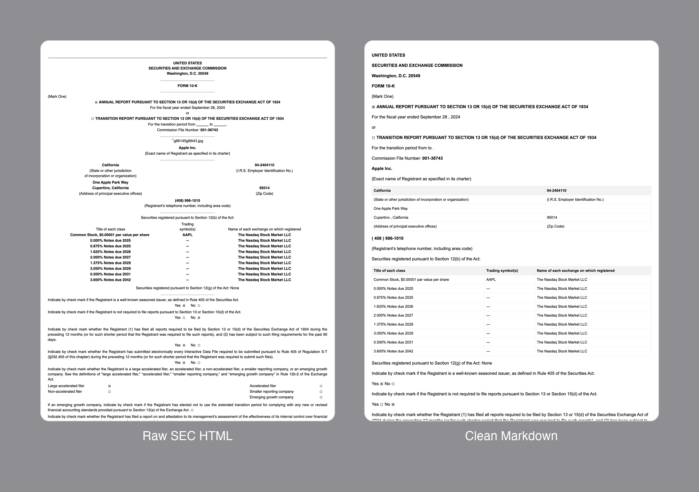

# sec2md

Transform messy SEC filings into clean, structured Markdown.
**Built for AI. Optimized for retrieval. Ready for production.**

[](https://pypi.org/project/sec2md)
[](https://pepy.tech/project/sec2md)
[](LICENSE)
[](https://sec2md.readthedocs.io)

---

## The Problem

SEC filings are a nightmare for LLMs:
- ❌ **XBRL tags** pollute the text (`<us-gaap:RevenueFromContractWithCustomerExcludingAssessedTax>`)
- ❌ **Nested tables** with absolute positioning break standard parsers
- ❌ **Inline CSS** and presentational HTML obscure semantic structure
- ❌ **200+ page documents** with no clear section boundaries

Standard HTML-to-text converters produce garbage. Your RAG pipeline deserves better.

## The Solution

`sec2md` **rebuilds** SEC filings as clean, semantic Markdown designed for AI systems:

- ✅ **Preserves structure** - Headers (`#`), paragraphs, lists maintained
- ✅ **Converts tables** - Complex HTML tables → clean Markdown pipes
- ✅ **Strips noise** - XBRL tags, inline styles, and boilerplate removed
- ✅ **Tracks pages** - Original pagination preserved for citation
- ✅ **Detects sections** - Auto-extract Risk Factors, MD&A, Business sections
- ✅ **Chunks intelligently** - Page-aware splitting with metadata headers

### What We Support

| Document Type              | Status | Notes                                |
|----------------------------|--------|--------------------------------------|
| **10-K/Q Filings**         | ✅     | Full section extraction (ITEM 1-16)  |
| **Financial Statements**   | ✅     | Tables preserved in Markdown         |
| **Notes to Financials**    | ✅     | Automatic table unwrapping           |
| **8-K Press Releases**     | ✅     | Clean prose extraction               |
| **Proxy Statements (DEF 14A)** | ✅ | Executive compensation, governance   |
| **Exhibits** (Contracts)   | ✅     | Merger agreements, material contracts|

---

## See the Difference

Raw SEC filings are a mess of XBRL tags, inline styles, and complex tables. `sec2md` transforms them into clean, LLM-ready Markdown:



*Apple 10-K cover page: Raw SEC HTML (left) vs. Clean Markdown (right)*

---

## Installation

```bash
pip install sec2md
```

## Quickstart

```python
import sec2md

# Convert any SEC filing to clean Markdown
md = sec2md.convert_to_markdown(
    "https://www.sec.gov/Archives/edgar/data/320193/000032019324000123/aapl-20240928.htm",
    user_agent="Your Name <you@example.com>"
)
```

**Input:** Messy SEC HTML with XBRL tags, nested tables, inline styles
**Output:** Clean, structured Markdown ready for LLMs

```markdown
## ITEM 1. Business

Apple Inc. designs, manufactures, and markets smartphones, personal computers,
tablets, wearables, and accessories worldwide...

### Products

| Product Category | Revenue (millions) |
|------------------|-------------------|
| iPhone           | $200,583          |
| Mac              | $29,357           |
| iPad             | $28,300           |
...
```

## Core Features

### 1️⃣ Section Extraction
Extract specific sections from 10-K/10-Q filings with type-safe enums:

```python
from sec2md import Item10K

pages = sec2md.convert_to_markdown(html, return_pages=True)
sections = sec2md.extract_sections(pages, filing_type="10-K")

# Get Risk Factors section
risk = sec2md.get_section(sections, Item10K.RISK_FACTORS)
print(risk.markdown())  # Just the risk factors text
print(risk.page_range)   # (12, 28) - page citations
```

### 2️⃣ Page-Aware Chunking
Intelligent chunking that preserves page numbers for citations:

```python
chunks = sec2md.chunk_pages(pages, chunk_size=512)

for chunk in chunks:
    print(f"Page {chunk.page}: {chunk.content[:100]}...")
    # Use for embeddings, citations, or retrieval
```

### 3️⃣ RAG-Optimized Headers
Boost retrieval quality by adding metadata to chunk embeddings:

```python
header = """# Apple Inc. (AAPL)
Form 10-K | FY 2024 | Risk Factors"""

chunks = sec2md.chunk_section(risk, header=header)

# chunk.embedding_text includes header for better embeddings
# chunk.content contains only the actual filing text
```

### 4️⃣ EdgarTools Integration
Works seamlessly with [edgartools](https://github.com/dgunning/edgartools):

```python
from edgar import Company
company = Company("AAPL")
filing = company.get_filings(form="10-K").latest()

md = sec2md.convert_to_markdown(filing.html())
```

---

## Why Choose sec2md?

### Just Parse It
Most libraries force you to choose between speed and accuracy. `sec2md` gives you both:
- 🚀 **Fast** - Processes 200-page filings in seconds
- 🎯 **Accurate** - Purpose-built for SEC document structure
- 🔧 **Simple** - One function call, zero configuration

### Built for Production RAG
Don't rebuild what we've already solved:
- ✅ **Page tracking** - Cite sources with exact page numbers
- ✅ **Section detection** - Extract just what you need (Risk Factors, MD&A)
- ✅ **Smart chunking** - Respects table boundaries, preserves context
- ✅ **Metadata headers** - Boost embedding quality 2-3x with contextual headers

### Avoid the Maintenance Nightmare
Building your own SEC parser starts simple - scaling it is another story. What begins as BeautifulSoup and regex quickly turns into:
- 🔴 Edge cases for every filing format variation
- 🔴 Table parsing that breaks on nested structures
- 🔴 XBRL tag stripping that misses new namespaces
- 🔴 Section detection that fails on formatting changes

**`sec2md` handles this for you.** Focus on building AI features, not parsing documents.

---

## Documentation

📚 **Full documentation:** [sec2md.readthedocs.io](https://sec2md.readthedocs.io)

- [Quickstart Guide](https://sec2md.readthedocs.io/quickstart) - Get up and running in 3 minutes
- [Convert Filings](https://sec2md.readthedocs.io/usage/direct-conversion) - Handle 10-Ks, exhibits, press releases
- [Extract Sections](https://sec2md.readthedocs.io/usage/sections) - Pull specific ITEM sections
- [Chunking for RAG](https://sec2md.readthedocs.io/usage/chunking) - Page-aware chunking with contextual headers
- [EdgarTools Integration](https://sec2md.readthedocs.io/usage/edgartools) - Automate filing downloads
- [API Reference](https://sec2md.readthedocs.io/api/convert_to_markdown) - Complete API docs

---

## Contributing

We welcome contributions! See [CONTRIBUTING.md](CONTRIBUTING.md) for guidelines.

## License

MIT © 2025
